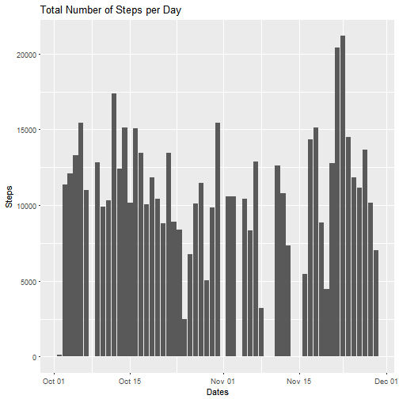
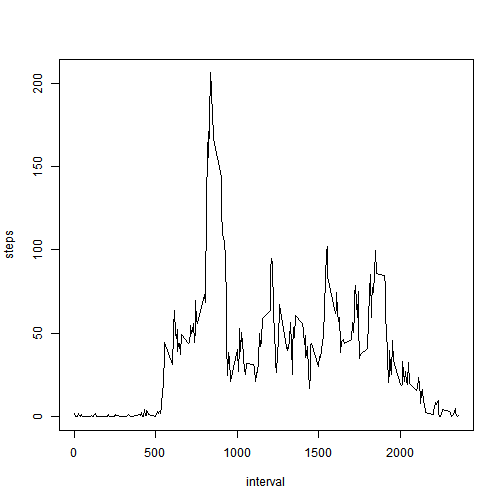
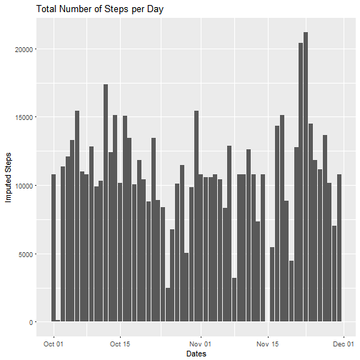
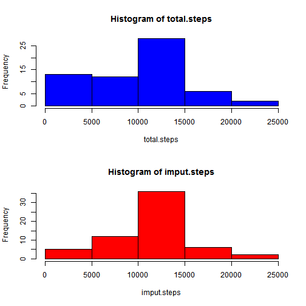
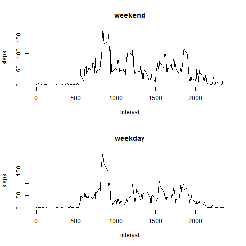

**LOADING AND PREPROCESSING THE DATA**

1. Load the data (i.e. read.csv())

```r
unzip("repdata%2Fdata%2Factivity.zip")
activity <- read.csv("activity.csv", colClasses = c("numeric", "character", "integer"))
```

2. Process/transform the data (if necessary) into a format suitable for your analysis

```r
dim(activity)
```

```
## [1] 17568     3
```

```r
head(activity)
```

```
##   steps       date interval
## 1    NA 2012-10-01        0
## 2    NA 2012-10-01        5
## 3    NA 2012-10-01       10
## 4    NA 2012-10-01       15
## 5    NA 2012-10-01       20
## 6    NA 2012-10-01       25
```

```r
tail(activity)
```

```
##       steps       date interval
## 17563    NA 2012-11-30     2330
## 17564    NA 2012-11-30     2335
## 17565    NA 2012-11-30     2340
## 17566    NA 2012-11-30     2345
## 17567    NA 2012-11-30     2350
## 17568    NA 2012-11-30     2355
```

```r
summary(activity)
```

```
##      steps            date              interval     
##  Min.   :  0.00   Length:17568       Min.   :   0.0  
##  1st Qu.:  0.00   Class :character   1st Qu.: 588.8  
##  Median :  0.00   Mode  :character   Median :1177.5  
##  Mean   : 37.38                      Mean   :1177.5  
##  3rd Qu.: 12.00                      3rd Qu.:1766.2  
##  Max.   :806.00                      Max.   :2355.0  
##  NA's   :2304
```

```r
str(activity)
```

```
## 'data.frame':	17568 obs. of  3 variables:
##  $ steps   : num  NA NA NA NA NA NA NA NA NA NA ...
##  $ date    : chr  "2012-10-01" "2012-10-01" "2012-10-01" "2012-10-01" ...
##  $ interval: int  0 5 10 15 20 25 30 35 40 45 ...
```

```r
library("plyr")
library("dplyr")
```

```
## 
## Attaching package: 'dplyr'
```

```
## The following objects are masked from 'package:plyr':
## 
##     arrange, count, desc, failwith, id, mutate, rename, summarise,
##     summarize
```

```
## The following objects are masked from 'package:stats':
## 
##     filter, lag
```

```
## The following objects are masked from 'package:base':
## 
##     intersect, setdiff, setequal, union
```

```r
library("ggplot2")

activity$date <- as.POSIXct(activity$date, format="%Y-%m-%d")
```

**WHAT IS THE MEAN TOTAL NUMBER OF STEPS TAKEN PER DAY?**
 
1. Calculate the total number of steps taken per day

```r
steps <- activity %>%
  filter(!is.na(steps)) %>%
  group_by(date) %>%
  summarize(steps=sum(steps)) %>%
  print()
```

```
## # A tibble: 53 x 2
##          date steps
##        <dttm> <dbl>
##  1 2012-10-02   126
##  2 2012-10-03 11352
##  3 2012-10-04 12116
##  4 2012-10-05 13294
##  5 2012-10-06 15420
##  6 2012-10-07 11015
##  7 2012-10-09 12811
##  8 2012-10-10  9900
##  9 2012-10-11 10304
## 10 2012-10-12 17382
## # ... with 43 more rows
```

2. If you do not understand the difference between a histogram and a barplot, research the difference between them. Make a histogram of the total number of steps taken each day

```r
ggplot(steps, aes(x=date, y=steps))+geom_histogram(stat="identity")+xlab("Dates")+ylab("Steps")+labs(title="Total Number of Steps per Day")
```

```
## Warning: Ignoring unknown parameters: binwidth, bins, pad
```



3. Calculate and report the mean and median of the total number of steps taken per day

```r
total.steps <- tapply(activity$steps, activity$date, FUN = sum, na.rm=TRUE)
mean(total.steps)
```

```
## [1] 9354.23
```

```r
median(total.steps)
```

```
## [1] 10395
```

**WHAT IS THE AVERAGE DAILY ACTIVITY PATTERN?**

1. Make a time series plot (i.e. type = "l") of the 5-minute interval (x-axis) and the average number of steps taken, averaged across all days (y-axis)

```r
daily <- activity %>%
  filter(!is.na(steps)) %>%
  group_by(interval) %>%
  summarize(steps=mean(steps))
print(daily)
```

```
## # A tibble: 288 x 2
##    interval     steps
##       <int>     <dbl>
##  1        0 1.7169811
##  2        5 0.3396226
##  3       10 0.1320755
##  4       15 0.1509434
##  5       20 0.0754717
##  6       25 2.0943396
##  7       30 0.5283019
##  8       35 0.8679245
##  9       40 0.0000000
## 10       45 1.4716981
## # ... with 278 more rows
```

```r
plot(daily, type = "l")
```



2. Which 5-minute interval, on average across all the days in the dataset, contains the maximum number of steps?

```r
daily[which.max(daily$steps), ]$interval
```

```
## [1] 835
```

**INPUTING MISSING VALUES**

1. Calculate and report the total number of missing values in the dataset (i.e. the total number of rows with NAs)

```r
missing <- sum(is.na(activity))
missing
```

```
## [1] 2304
```

2. Devise a strategy for filling in all of the missing values in the dataset. The strategy does not need to be sophisticated. For example, you could use the mean/median for that day, or the mean for that 5-minute interval, etc.

3. Create a new dataset that is equal to the original dataset but with the missing data filled in.

```r
new <- activity %>%
  group_by(interval) %>%
  mutate(steps=ifelse(is.na(steps), mean(steps, na.rm=TRUE), steps))
summary(new)
```

```
##      steps             date               interval     
##  Min.   :  0.00   Min.   :2012-10-01   Min.   :   0.0  
##  1st Qu.:  0.00   1st Qu.:2012-10-16   1st Qu.: 588.8  
##  Median :  0.00   Median :2012-10-31   Median :1177.5  
##  Mean   : 37.38   Mean   :2012-10-31   Mean   :1177.5  
##  3rd Qu.: 27.00   3rd Qu.:2012-11-15   3rd Qu.:1766.2  
##  Max.   :806.00   Max.   :2012-11-30   Max.   :2355.0
```

4. Make a histogram of the total number of steps taken each day and Calculate and report the mean and median total number of steps taken per day. Do these values differ from the estimates from the first part of the assignment? What is the impact of imputing missing data on the estimates of the total daily number of steps?

```r
new.steps <- new %>%
  group_by(date) %>%
  summarize(steps=sum(steps))
print(new.steps)
```

```
## # A tibble: 61 x 2
##          date    steps
##        <dttm>    <dbl>
##  1 2012-10-01 10766.19
##  2 2012-10-02   126.00
##  3 2012-10-03 11352.00
##  4 2012-10-04 12116.00
##  5 2012-10-05 13294.00
##  6 2012-10-06 15420.00
##  7 2012-10-07 11015.00
##  8 2012-10-08 10766.19
##  9 2012-10-09 12811.00
## 10 2012-10-10  9900.00
## # ... with 51 more rows
```

```r
ggplot(new.steps, aes(x=date, y=steps))+geom_histogram(stat="identity")+xlab("Dates")+ylab("Imputed Steps")+labs(title="Total Number of Steps per Day")
```

```
## Warning: Ignoring unknown parameters: binwidth, bins, pad
```



```r
imput.steps <- tapply(new$steps, new$date, FUN=sum, na.rm=TRUE)
mean(imput.steps)
```

```
## [1] 10766.19
```

```r
median(imput.steps)
```

```
## [1] 10766.19
```

```r
mean(total.steps)==mean(imput.steps)
```

```
## [1] FALSE
```

```r
median(total.steps)==median(imput.steps)
```

```
## [1] FALSE
```

```r
summary(total.steps)
```

```
##    Min. 1st Qu.  Median    Mean 3rd Qu.    Max. 
##       0    6778   10395    9354   12811   21194
```

```r
summary(imput.steps)
```

```
##    Min. 1st Qu.  Median    Mean 3rd Qu.    Max. 
##      41    9819   10766   10766   12811   21194
```

```r
par(mfrow=c(2,1))
hist(total.steps,col="blue")
hist(imput.steps,col="red")
```



**ARE THERE DIFFERENCES IN ACTIVITY PATTERNS BETWEEN WEEKDAYS AND WEEKENDS?**

1. Create a new factor variable in the dataset with two levels - "weekday" and "weekend" indicating whether a given date is a weekday or weekend day.

```r
dayofweek <- function(date) {
  if (weekdays(as.Date(date)) %in% c("Saturday", "Sunday")) {
    "weekend"
  } else {
    "weekday"
  }
}
new$daytype <- as.factor(sapply(new$date, dayofweek))
```

2. Make a panel plot containing a time series plot (i.e. type = "l") of the 5-minute interval (x-axis) and the average number of steps taken, averaged across all weekday days or weekend days (y-axis). See the README file in the GitHub repository to see an example of what this plot should look like using simulated data.

```r
par(mfrow = c(2, 1))
for (type in c("weekend", "weekday")) {
  steps.type <- aggregate(steps ~ interval, data = new, subset = new$daytype == 
                            type, FUN = mean)
  plot(steps.type, type = "l", main = type)
}
```


